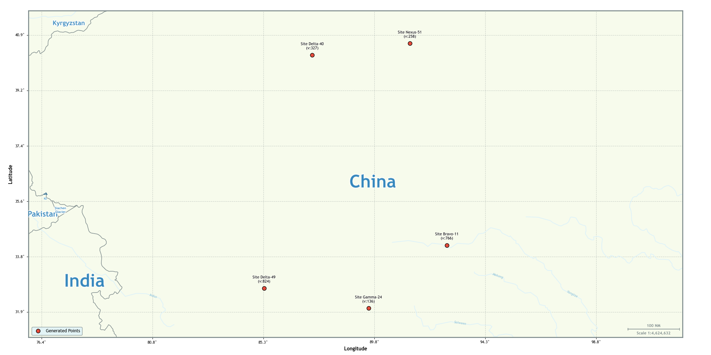
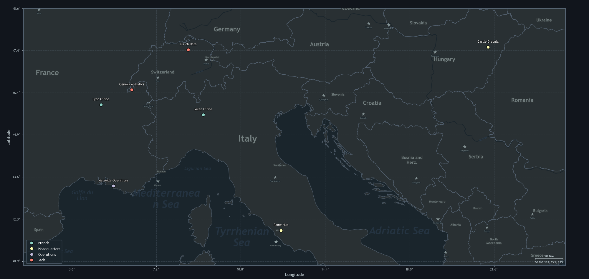

# t3map

A lightweight, purely Python-based tool for rendering beautiful, publication-ready regional maps. Packaged as a global CLI (`t3map`) and built on top of `matplotlib`, it allows you to rapidly plot coordinates from CSVs onto stylized map backgrounds with smart layouts, automatic legends, scale bars, and robust support for categorical coloring.

## Example Output

### Normal Fit Mode (Strict 2:1 Ratio)
By default, the map generator enforces strict bounding box constraints (e.g., 20x10 inches), intelligently padding your map data to fit the required aspect ratio perfectly.



### Dynamic Fit Mode
Alternatively, you can allow the map to dynamically snap to the exact aspect ratio of your data points, ensuring minimal whitespace and a tightly fitted layout.



## Features
* **Zero Heavy GIS Dependencies**: Relies entirely on `matplotlib` and Python's standard `json`/`math` libraries (no `geopandas`, `GDAL`, or `rasterio` required).
* **Smart CSV Loading**: Drop in a CSV, map your columns (`lat`, `lon`, `label`, `group`), and the script will automatically parse coordinates and group elements by category.
* **Intelligent Fit Modes**:
  * `--fit-mode normal`: Locks output size to exact width/height (default 20x10) and pads map.
  * `--fit-mode dynamic`: Dynamically scales the height of the image to perfectly enclose the data.
* **Auto-generated Legends & Scalebars**: Features perfectly aligned baselines, calculated Nautical Mile (NM) scalebars, and beautiful qualitative color palettes.
* **Dark Mode**: Comes with built-in `--dark-mode` toggle that gracefully inverts color palettes for a sleek, modern look.
* **Layer Support**: Optionally overlay water bodies, rivers, and high-resolution map features dynamically scaling based on zoom level.

## Installation

`t3map` is designed to be installed as a standard Python package, which exposes the `t3map` command globally in your terminal.

**1. Build the Wheel:**
First, build the project into a `.whl` package using `build`:
```bash
pip install build
python -m build
```

**2. Install the Package:**
Once built, you can install the wheel directly via `pip` (it will automatically pull down dependencies like `matplotlib`):
```bash
pip install dist/t3map-0.1.0-py3-none-any.whl
```

## Usage

Once installed, simply call `t3map` from anywhere. The tool comes bundled with built-in world geometry data, so you don't need to pass any GeoJSON paths manually.

Generate a map using a provided CSV of coordinates:

```bash
t3map --csv example_data.csv --fit-mode dynamic
```

### Key Arguments

**Input / Output:**
* `--csv`: Path to CSV file containing your coordinates.
* `-o`, `--output`: Output image filename (default: `/tmp/map.png`).
* `--dark-mode`: Render map using the dark color scheme.
* `--fit-mode`: Fit mode, either `normal` (fixed image size, padded map) or `dynamic` (image expands to wrap data).

**Map Adjustments:**
* `--width`, `--height`: Requested width/height in inches (defaults to 20.0 x 10.0).
* `--margin`: Fractional margin around points (default: 0.2).

**Data Formats:**
If the CSV uses non-standard column headers, map them directly:
* `--csv-lat`: Latitude column name
* `--csv-lon`: Longitude column name
* `--csv-label`: Point label column name
* `--csv-group`: Categorical grouping column name

## Data Credits
* **Map Data**: Geographic boundary vectors (Land, Water, Rivers) are derived from the excellent open-source datasets provided by [Natural Earth](https://www.naturalearthdata.com/).
* **Color Palettes**: Categorical group colors utilize the `Set3` qualitative color palette sourced from `matplotlib` (originally derived from ColorBrewer).

## License
This project is open-sourced under the [MIT License](LICENSE).
